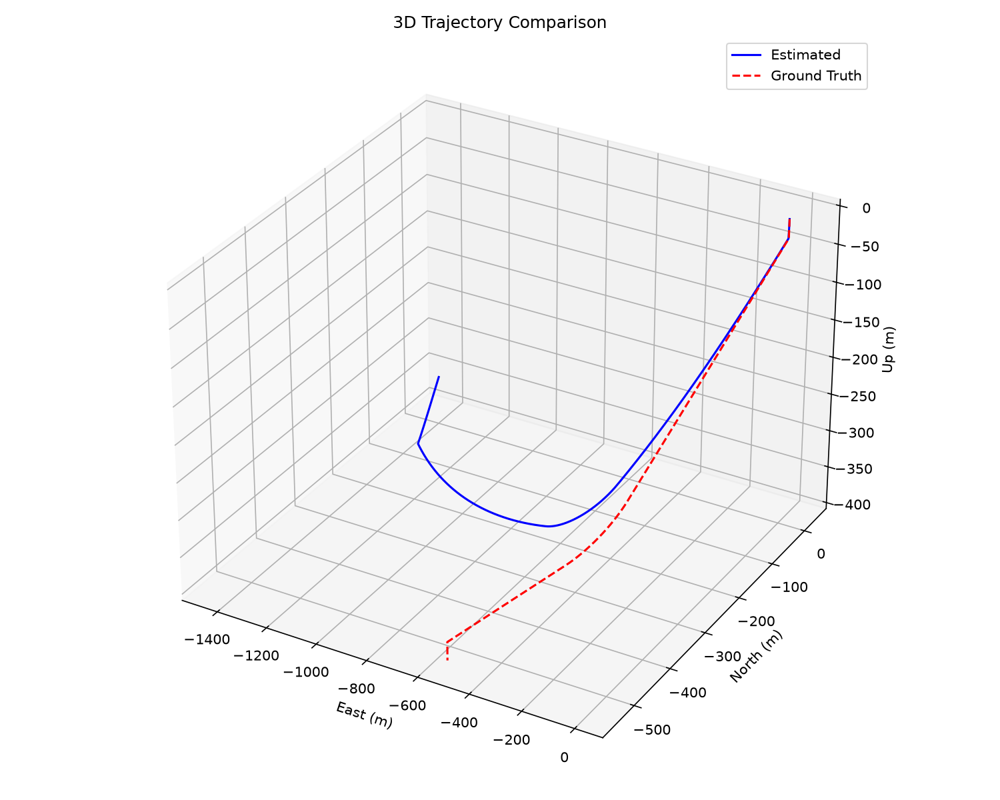
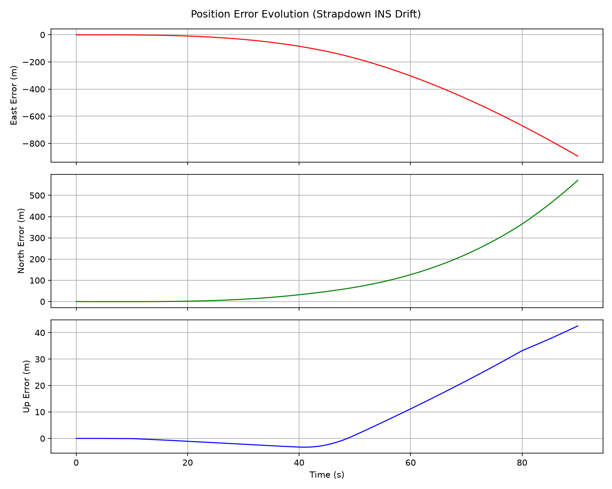
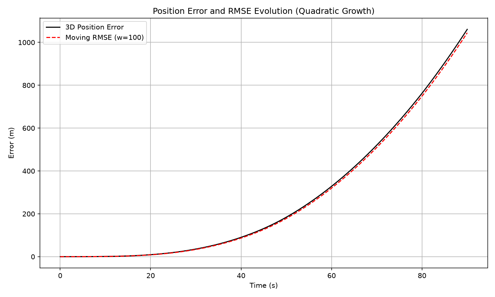

# INS_Mechanization — Inertial Navigation System Mechanization

**Author:** Mohammed Hsiny
**Field:** Electrical Engineering & Industrial Control Student
**Institution:** Faculty of Sciences and Techniques of Mohammedia
**Year:** 2025 – 2026
**Repository:** inertial-navigation-mechanization_hsiny_med

---

## Overview

This project implements a complete **Inertial Navigation System (INS)
mechanization** in C++ for a strapdown IMU, with trajectory analysis and
error visualization in GNU Octave. It includes a Python-based synthetic
IMU data generator to simulate realistic flight trajectories and sensor
imperfections (biases, noise).

The goal is to demonstrate, through simulation and quantitative analysis,
**why pure inertial navigation cannot remain accurate over long durations**,
and to establish the foundation for a sensor-fusion architecture
(IMU + aiding sources) suitable for autonomous drone navigation in
GPS-denied environments.

---

## Motivation

My original goal was to build an **autonomous kamikaze drone** that could
navigate, patrol, and strike a target using **inertial navigation only** —
no GPS, no external signals. The reasoning was simple: with the massive
use of drones in modern conflicts (Ukraine, Russia, Iran), GPS jamming
and electronic warfare have become the norm, and any system that depends
on satellite signals is vulnerable.

The historical reference for this idea was the **V2 ballistic missile**
(Germany, 1942–1945), the world's first operational ballistic missile.
Its guidance system was purely inertial: a stabilized gyroscopic platform
combined with a pendulous integrating gyroscopic accelerometer (PIGA) and
an analog computer (the *Mischgerät*) that cut off the engine once the
required velocity was reached. It was brilliant for its time — but
**inaccurate by design**, with a CEP of several kilometers.

The question I wanted to answer was:

> *Can a modern drone navigate autonomously using only an IMU, without
> any external aiding source?*

To answer it rigorously, I implemented a full inertial navigation
mechanization, built a synthetic IMU data generator, and ran simulations
on realistic flight trajectories. The result was unambiguous:

**Pure inertial navigation is not viable over long durations.**

Even with careful bias calibration and Zero Velocity Updates, the position
error grows quadratically with time. This is not a limitation of the
implementation — it is a **fundamental mathematical consequence** of
integrating sensor errors twice.

This finding is the **central result of the project**: it explains why
modern autonomous systems (including the drone systems used in Ukraine
and Iran) rely on **sensor fusion** — IMU for short-term dynamics, aided
by optical flow, visual-inertial odometry, or GNSS when available — rather
than on inertial navigation alone.

The project is therefore both a **proof of concept** and a **negative
result**: it demonstrates what does not work, and why, laying the
foundation for the sensor-fusion architecture that is the next step.

---

## What This Project Does

### 1. IMU Mechanization (C++)

The core of the project is a full strapdown INS mechanization implemented
in C++11, using the **Eigen3** library for linear algebra. It performs
three fundamental updates at each time step:

- **Attitude update** — quaternion propagation from gyroscope measurements
- **Velocity update** — integration of accelerometer data, corrected for
  Earth rotation (Coriolis), transport rate, and normal gravity (WGS84)
- **Position update** — integration of velocity over a WGS84 ellipsoid

The mechanization also includes:

- **Static bias calibration** for both accelerometer and gyroscope
- **Zero Velocity Update (ZVU)** correction
- Configurable processing modes (example data vs. self-generated data)

### 2. Synthetic IMU Data Generator (Python)

A Python script (`simulation/generate_imu_data.py`) generates realistic
synthetic IMU data for a 90-second drone flight:

- Vertical takeoff
- Level flight North
- Coordinated right turn
- Level flight East
- Descent

Realistic sensor biases and Gaussian noise are added to the accelerometer
and gyroscope outputs, and a corresponding **ground-truth trajectory** is
produced for comparison.

### 3. Error Analysis (GNU Octave / MATLAB)

A suite of analysis scripts computes and visualizes:

- 3D trajectory comparison (estimated vs. ground truth)
- Position error over time (horizontal and vertical)
- Velocity and attitude errors
- **RMSE** evolution over time

The expected result — and the central lesson of this project — is that
the position error **grows quadratically with time** under pure inertial
navigation, even with well-calibrated sensors.

### 4. Results Visualization (Python)

A Python script (`simulation/plot_results.py`) generates publication-ready
figures from the C++ output, including 3D trajectory comparison, position
error evolution, and RMSE curves.

---

## Results

The following figures are generated by `simulation/plot_results.py`:





*Note: These images are generated after running the simulation and analysis
pipeline. The position error grows quadratically with time, confirming the
theoretical drift of pure inertial navigation.*

---

## Mathematical Foundation

The mechanization is based on the standard strapdown INS equations, as
described in the classical references of the field:

- Titterton, D. H., & Weston, J. L. (2004). *Strapdown Inertial Navigation
  Technology*, 2nd ed. IET.
- Groves, P. D. (2013). *Principles of GNSS, Inertial, and Multisensor
  Integrated Navigation Systems*, 2nd ed. Artech House.
- Farrell, J. A. (2008). *Aided Navigation: GPS with High Rate Sensors*.
  McGraw-Hill.

Key relations implemented:

- Quaternion kinematics: `q̇ = ½ · q ⊗ ω`
- Velocity dynamics in the navigation frame:
  `v̇ⁿ = C_bⁿ · fᵇ − (2·Ω_ieⁿ + Ω_enⁿ) × vⁿ + gⁿ`
- Geodetic position rates over a WGS84 ellipsoid

---

## Project Structure

```
.
├── code/                  # C++ INS mechanization source
│   ├── main.cpp
│   ├── NavigationUpdate.cpp
│   ├── Calculations.cpp
│   ├── Calibration.cpp
│   ├── CoordinateChange.cpp
│   ├── ReadFile.cpp / SaveFile.cpp
│   ├── MatrixPrint.cpp
│   ├── Data/              # Input data (IMU + ground truth)
│   └── Result/            # Octave analysis scripts & figures
│       ├── main.m
│       ├── DataFig.m
│       ├── DiffFig.m
│       ├── dEnuFig.m
│       ├── RmseWithTime.m
│       ├── ReadFile.m
│       └── rmse.m
├── simulation/            # Python tools
│   ├── generate_imu_data.py
│   ├── plot_results.py
│   ├── requirements.txt
│   └── README.md
├── report/                # Technical report & presentation
│   ├── lab_report.docx    # Complete English technical report (Word)
│   ├── lab_report.pdf     # Publication-grade technical report (PDF)
│   └── diagrams.pptx      # Project presentation & flow diagrams
├── .gitignore
├── LICENSE
└── README.md
```

---

## Build & Run

### Prerequisites

- A C++11 compiler (g++ recommended)
- **Eigen3** (header-only linear algebra library)
- **Python 3** with NumPy, Matplotlib, SciPy, Pandas
- **GNU Octave** (or MATLAB) for analysis

### Install Eigen3 (MSYS2)

```bash
pacman -S mingw-w64-x86_64-eigen3
```

### Generate Synthetic IMU Data

```bash
cd simulation
pip install -r requirements.txt
python generate_imu_data.py
cp Data/GroupOne.ASC ../code/Data/
cp Data/TruthOne.nav ../code/Data/
```

### Compile the INS Mechanization

```bash
cd code
g++ -std=c++11 main.cpp Calculations.cpp Calibration.cpp \
    CoordinateChange.cpp NavigationUpdate.cpp ReadFile.cpp \
    SaveFile.cpp MatrixPrint.cpp \
    -I /mingw64/include/eigen3 -o ins_mechanization.exe
```

### Run

```bash
./ins_mechanization.exe
# Choose Mode 1 (Self-test) when prompted
```

### Analyze Results with Octave

```matlab
cd code/Result
main
```

### Generate Publication-Ready Figures

```bash
cd simulation
python plot_results.py
```

This generates all figures in `simulation/Figures/`.

---

## Key Result

The simulation quantitatively confirms that **pure inertial navigation is
not viable over long durations**. Even with bias calibration and ZVU
correction, the position error diverges in a manner consistent with the
theory:

- Constant accelerometer bias → **quadratic** position error growth (t²)
- Sensor noise → **random-walk** error propagation

This is the reason modern autonomous systems rely on **sensor fusion**:
IMU provides high-frequency short-term dynamics, while aiding sources
(optical flow, visual-inertial odometry, GNSS when available) bound the
drift.

---

## Roadmap / Ongoing Work

This project is a first building block toward a larger goal:
**an autonomous drone capable of patrolling, detecting, and reacting
in GPS-denied environments** using onboard sensor fusion.

Next steps:

- Integrate a **Kalman filter** for IMU + optical flow fusion
- Add **Visual-Inertial Odometry (VIO)** support
- Implement a **bank-of-estimators** architecture for redundancy
- Test on real hardware (Raspberry Pi + Pixhawk)

---

## References

1. Titterton, D. H., & Weston, J. L. (2004). *Strapdown Inertial Navigation
   Technology*, 2nd ed. IET.
2. Groves, P. D. (2013). *Principles of GNSS, Inertial, and Multisensor
   Integrated Navigation Systems*, 2nd ed. Artech House.
3. Farrell, J. A. (2008). *Aided Navigation: GPS with High Rate Sensors*.
   McGraw-Hill.

---

## Author

**Mohammed Hsiny**
Electrical Engineering & Industrial Control Student
Faculty of Sciences and Techniques of Mohammedia

Interests: inertial navigation, sensor fusion, autonomous aerial systems,
embedded AI.
